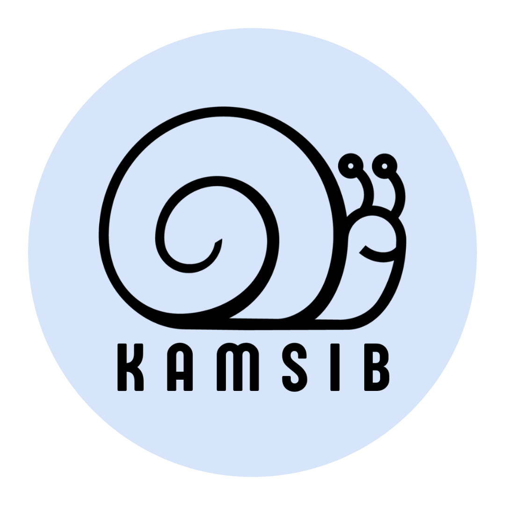
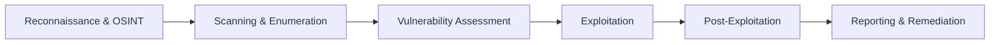

# 🛡️ Penetration Testing — Kamar Kamsib

<div align="center">
  
  <p><strong>Tulisan ini didedikasikan untuk para anggota grup Pentesting Indonesia di Kamar Kamsib.</strong></p>
  
  [](https://t.me/PentestingIndonesia)
  [](https://t.me/KamarKamsib)
  [](https://owasp.org)
</div>

---

Selamat datang di repositori pembelajaran **Penetration Testing (Pentest) Kamar Kamsib**! Repositori ini dirancang khusus untuk membagikan materi, konsep dasar, *best practice*, standar industri, contoh dokumen, hingga kumpulan *payload* yang siap digunakan oleh para pemula maupun praktisi keamanan informasi di Indonesia.

---

## 🎯 Kontributor
Kontributor utama repositori ini:
* 👤 **[rad1zly](https://github.com/rad1zly)**
* 👤 **[anton](https://github.com/antonlepari)**
* 🤝 **Ingin Berkontribusi?** Kami sangat terbuka! Silakan kirimkan Pull Request (PR) Anda untuk melengkapi repositori ini.

---

## 🗺️ Panduan Outline Materi

1. [01. Apa sih Penetration Testing itu?](#01-apa-sih-penetration-testing-itu)
2. [02. Siapa yang Membutuhkan Pentesting?](#02-siapa-yang-membutuhkan-pentesting)
3. [03. Pentesting vs Bug Bounty: Apa Bedanya?](#03-pentesting-vs-bug-bounty-apa-bedanya)
4. [04. Metodologi Standar Industri](#04-metodologi-standar-industri)
5. [05. Tahapan Umum Penetration Testing](#05-tahapan-umum-penetration-testing)
6. [06. OWASP Top 10 2021 & Skenario Serangan](#06-owasp-top-10-2021--skenario-serangan)
7. [07. Peta Jalan Menjadi Pentester Profesional](#07-peta-jalan-menjadi-pentester-profesional)
* **[Dark-Moon](https://github.com/ASCIT31/Dark-Moon)** — Platform open-source (GPL-3.0) untuk penetration testing otomatis berbasis agen AI (web, API, Active Directory, Kubernetes); di-host sendiri dan dilengkapi Privacy Gateway lokal yang menyamarkan data sensitif sehingga LLM tidak pernah melihat nilai aslinya.
8. [99. Referensi Kumpulan Payload Terpopuler](#99-referensi-kumpulan-payload-terpopuler)
9. [100. Analisis Persyaratan Pekerjaan Pentester](#100-analisis-persyaratan-pekerjaan-pentester)
10. [🎄 Latihan Tambahan (Advent of Cyber Writeups)](#latihan-menggunakan-santa-thm)

---

## 01. Apa sih Penetration Testing itu?

**Penetration Testing** (atau sering disingkat **Pentest**) adalah metode pengujian keamanan sistem komputer, jaringan, atau aplikasi web dengan cara mensimulasikan serangan nyata dari pihak luar (*hacker*) secara legal dan terstruktur.

> **⚠️ Pentest vs Vulnerability Scanning:**
> * **Vulnerability Scanning**: Proses otomatis menggunakan perangkat lunak (seperti Nessus atau OpenVAS) untuk mencari daftar celah keamanan yang diketahui tanpa melakukan eksploitasi lebih lanjut.
> * **Penetration Testing**: Menggabungkan pemindaian otomatis dan analisis manual mendalam untuk mengeksploitasi celah keamanan guna menguji ketahanan model keamanan secara keseluruhan serta mengukur dampak riil serangan terhadap bisnis.

---

## 02. Siapa yang Membutuhkan Pentesting?

Pada dasarnya, **semua organisasi yang memiliki infrastruktur digital dan memproses data sensitif** membutuhkan pentesting. Beberapa di antaranya meliputi:

1. **Perusahaan Finansial & FinTech**: Bank, e-wallet, dan gerbang pembayaran (*payment gateway*) wajib melakukan pentesting untuk mematuhi regulasi ketat (seperti PCI-DSS dan aturan BI/OJK).
2. **Platform E-Commerce**: Untuk mengamankan data transaksi pelanggan, kartu kredit, dan mencegah manipulasi harga barang.
3. **Instansi Pemerintah & BUMN**: Mengamankan sistem layanan publik kritikal dari sabotase atau kebocoran data nasional.
4. **Penyedia Layanan SaaS/Cloud**: Memastikan data dari ribuan klien yang disimpan dalam platform mereka aman dari akses tidak sah.
5. **Startup Teknologi**: Membangun kepercayaan pelanggan sejak awal dengan memastikan produk digital mereka sudah teruji keamanannya sebelum diluncurkan.

---

## 03. Pentesting vs Bug Bounty: Apa Bedanya?

Meskipun keduanya bertujuan untuk menemukan celah keamanan, terdapat perbedaan mendasar yang krusial dari segi cakupan, metode, dan tujuan operasional:

| Parameter | 🛡️ Penetration Testing | 🎯 Bug Bounty |
| :--- | :--- | :--- |
| **Model Pembayaran** | Berdasarkan waktu/proyek yang disepakati (*fixed rate*). | Berdasarkan kualitas celah keamanan yang ditemukan (*pay-per-vulnerability*). |
| **Cakupan Pengujian** | Menyeluruh (mencakup dokumentasi sistem, arsitektur, dan seluruh aspek keamanan baik yang terlihat maupun tidak). | Fokus pada celah kritis tertentu yang terdaftar di dalam program (*restricted scope*). |
| **Akses & Skenario** | Sering kali mencakup skenario *White Box* atau *Gray Box* (menyediakan akun uji, kode sumber, atau diagram jaringan). | Mayoritas menggunakan skenario *Black Box* (tanpa informasi awal sama sekali). |
| **Evaluasi Risiko** | Memberikan laporan komprehensif tentang postur pertahanan, termasuk celah keamanan rendah (*low/medium*) dan analisis kepatuhan. | Biasanya hanya memprioritaskan temuan berdampak tinggi (*critical/high*) demi mengejar bayaran terbesar. |
| **Keandalan Waktu** | Dapat dijadwalkan secara berkala (misal: sebelum rilis produk baru atau setahun sekali). | Berjalan terus-menerus tanpa batas waktu yang pasti dan tidak menjamin kelengkapan evaluasi pada tanggal tertentu. |

---

## 04. Metodologi Standar Industri

Dalam pelaksanaan pentesting profesional, agar proses pengujian dapat dipertanggungjawabkan dan konsisten, pentester mengacu pada kerangka kerja (metodologi) standar industri berikut:

* **[PTES (Penetration Testing Execution Standard)](PTES/README.md)**  
  Standar komprehensif yang membagi proses pentest ke dalam 7 tahap utama, mulai dari komunikasi pra-kesepakatan hingga eksploitasi dan pelaporan terperinci.
* **NIST CSF (Cybersecurity Framework) & SP 800-115**  
  Pedoman teknis dari pemerintah Amerika Serikat untuk melakukan pengujian keamanan informasi dan penilaian teknis secara berkala di level organisasi/enterprise.
* **OWASP WSTG (Web Security Testing Guide)**  
  Panduan terlengkap di dunia untuk pengujian keamanan aplikasi web secara spesifik, yang mencakup ratusan skenario pengujian di seluruh alur logika web.
* **OSSTMM (Open Source Security Testing Methodology Manual)**  
  Metodologi ilmiah berbasis metrik operasional untuk menguji keamanan operasional di tingkat jaringan, nirkabel (*wireless*), telekomunikasi, dan keamanan fisik.

---

## 05. Tahapan Umum Penetration Testing

Proses pentesting dibagi menjadi beberapa tahapan logis berikut:



### 🔍 05.1 Reconnaissance dan Information Gathering
* **Tujuan**: Mengumpulkan informasi sebanyak mungkin mengenai target tanpa berinteraksi secara agresif/langsung dengan infrastruktur utama.
* **Cara/Teknik**:
  - Menggunakan WHOIS lookup dan DNS enumeration (`dig`, `nslookup`).
  - Memanfaatkan Google Dorking dan pencarian OSINT pada repositori publik (seperti mencari token bocor di GitHub).
  - Menggunakan platform seperti Shodan atau Censys untuk mengidentifikasi port terbuka yang terindeks publik.

### 🌐 05.2 Network Enumeration and Scanning
* **Tujuan**: Mengidentifikasi sistem yang aktif (*live hosts*), layanan yang berjalan (*services*), sistem operasi, serta versi port yang terbuka pada target.
* **Cara/Teknik**:
  - Menggunakan `Nmap` untuk pemindaian port dan identifikasi servis secara mendalam.
  - Melakukan sub-domain enumeration dengan `Subfinder`, `Amass`, atau `Assetfinder`.
  - Melakukan direktori fuzzing menggunakan `FFuF`, `Gobuster`, atau `Dirsearch`.

### ⚡ 05.3 Vulnerability Testing and Exploitation
* **Tujuan**: Menganalisis apakah terdapat kerentanan pada layanan yang teridentifikasi, membuktikan kerentanan tersebut dengan melakukan eksploitasi terkontrol, dan mengukur tingkat risiko riil.
* **Cara/Teknik**:
  - Pemindaian kerentanan otomatis menggunakan `Nessus` atau `OpenVAS`.
  - Pengujian exploit publik melalui database seperti Exploit-DB, searchsploit, atau modul `Metasploit`.
  - Melakukan eksploitasi manual pada kerentanan aplikasi web (seperti SQLi, XSS, SSRF).
  - Melakukan *Post-Exploitation* (seperti eskalasi hak akses / *privilege escalation*, dan pivoting ke jaringan internal).

### 📝 05.4 Reporting
* **Tujuan**: Mendokumentasikan seluruh temuan celah keamanan beserta bukti konsep (PoC), dampak bisnis, serta rekomendasi perbaikan yang jelas bagi tim developer.
* **Cara/Teknik**:
  - Menulis laporan eksekutif (untuk jajaran manajemen non-teknis) dan laporan teknis (untuk tim IT/developer).
  - Menggunakan kalkulator CVSS untuk menentukan tingkat keparahan (*severity*).
  - Merekomendasikan langkah mitigasi nyata untuk setiap celah keamanan.

---

## 06. OWASP Top 10 2021 & Skenario Serangan

OWASP Top 10 merupakan standar konsensus global mengenai risiko keamanan paling kritis pada aplikasi web saat ini. Berikut adalah rincian 10 kerentanan tersebut beserta penjelasan operasionalnya:

### 🔏 A01 Broken Access Control
Terjadi ketika aplikasi gagal membatasi hak akses pengguna secara benar, sehingga pengguna biasa dapat mengakses fitur atau data pengguna lain/administrator.
* **Contoh Skenario**: Mengubah ID parameter pada URL, misalnya mengakses `https://target.com/profile?id=1001` menjadi `https://target.com/profile?id=1002` untuk melihat data sensitif akun lain secara langsung (**IDOR**).

### 🔑 A02 Cryptographic Failures
Kerentanan yang berkaitan dengan perlindungan data sensitif baik saat dikirimkan di jaringan (*in-transit*) maupun saat disimpan dalam database (*at-rest*).
* **Contoh Skenario**: Menggunakan protokol HTTP tanpa enkripsi (bukan HTTPS), menggunakan algoritma hashing usang (seperti MD5 atau SHA1) untuk menyimpan password, atau kunci enkripsi didefinisikan secara statis di dalam kode (*hardcoded*).

### 💉 A03 Injection
Kerentanan klasik di mana input dari pengguna diteruskan langsung ke interpreter query tanpa adanya validasi atau sanitasi yang ketat.
* **Contoh Skenario**: SQL Injection (SQLi) di mana input `' OR 1=1 --` disisipkan ke form login sehingga penyerang berhasil masuk tanpa menggunakan username/password yang valid.

### 🏛️ A04 Insecure Design
Kategori baru yang berfokus pada kelemahan keamanan yang terjadi pada level arsitektur dan desain aplikasi sejak awal sebelum kode diimplementasikan.
* **Contoh Skenario**: Sistem lupa menyertakan pembatasan upaya login (*rate limiting*) pada sistem transfer dana, sehingga penyerang dapat melakukan bruteforce transaksi secara berulang tanpa dibatasi.

### ⚙️ A05 Security Misconfiguration
Konfigurasi server atau komponen aplikasi yang kurang aman karena dibiarkan menggunakan setelan default, tidak diperbarui, atau menampilkan pesan error sistem yang terlalu detail.
* **Contoh Skenario**: Membiarkan kredensial admin default aktif pada dashboard (seperti `admin:admin`), atau mengaktifkan mode debug (*debug mode*) di lingkungan produksi sehingga stack trace database terekspos ke publik saat terjadi error.

### 📦 A06 Vulnerable and Outdated Components
Terjadi ketika pengembang menggunakan library, modul, framework, atau sistem operasi pihak ketiga yang telah diketahui memiliki celah keamanan (CVE) dan tidak diperbarui (*patched*).
* **Contoh Skenario**: Menggunakan versi jQuery, WordPress, atau library OpenSSL lama yang rentan terhadap serangan Remote Code Execution (RCE).

### 👤 A07 Identification and Authentication Failures
Kegagalan dalam memverifikasi identitas pengguna dengan benar, sehingga penyerang dapat memanipulasi sesi aktif atau menebak kredensial dengan mudah.
* **Contoh Skenario**: Memperbolehkan password yang sangat lemah, tidak menerapkan Multi-Factor Authentication (MFA), atau tidak merusak token sesi (*session token*) di sisi server saat pengguna melakukan logout.

### 🔗 A08 Software and Data Integrity Failures
Kegagalan dalam memverifikasi integritas kode aplikasi atau data yang dikirimkan. Hal ini termasuk penggunaan repositori kode eksternal tanpa verifikasi keamanan, atau manipulasi data terserialisasi.
* **Contoh Skenario**: Insecure Deserialization, di mana aplikasi menerima objek serialisasi dari pengguna secara mentah-mentah sehingga objek tersebut dieksekusi sebagai perintah sistem jarak jauh (RCE).

### 📊 A09 Security Logging and Monitoring Failures
Kegagalan sistem dalam mencatat aktivitas penting (log) dan memantau kejadian mencurigakan secara real-time, sehingga penyerang dapat beroperasi di dalam jaringan tanpa terdeteksi dalam waktu yang lama.
* **Contoh Skenario**: Tidak mencatat aktivitas login gagal yang masif (*bruteforce*) atau tidak mengirimkan notifikasi peringatan (*alerting*) saat terjadi aktivitas mencurigakan pada database admin.

### 🛰️ A10 Server-Side Request Forgery (SSRF)
Kerentanan di mana server backend dipaksa oleh penyerang untuk mengirimkan HTTP request ke alamat eksternal maupun internal yang seharusnya tidak dapat diakses secara langsung oleh publik.
* **Contoh Skenario**: Memasukkan alamat IP internal (`http://192.168.1.1/admin`) pada parameter input URL impor gambar, sehingga server mengeksekusi request tersebut dan menampilkan halaman admin internal ke penyerang.

---

## 07. Peta Jalan Menjadi Pentester Profesional

Untuk berkarier sebagai Penetration Tester profesional, berikut adalah jalur belajar terstruktur yang sangat disarankan:

```
[Level Dasar] ──────> [Level Menengah] ──────> [Sertifikasi & Karir]
- Linux/Windows       - Web & API Testing     - eJPT / PNPT (Pemula)
- Dasar Jaringan      - Network Pentest       - OSCP / GPEN (Menengah)
- Python/Bash         - Privilege Escalation  - OSWE / GXPN (Lanjut)
```

### 1. Fondasi Dasar (Prerequisites)
* **Dasar Jaringan (Networking)**: Memahami protokol TCP/IP, model OSI, cara kerja DNS, HTTP/HTTPS, subnetting, dan routing.
* **Sistem Operasi (OS)**: Menguasai navigasi baris perintah (*command line*) pada Linux (Ubuntu, Debian) dan Windows Powershell/CMD.
* **Bahasa Pemrograman Dasar**: Minimal memahami alur logika pemrograman menggunakan **Python**, **Javascript**, atau **Bash Scripting** untuk otomatisasi tugas.

### 2. Platform Belajar Praktis (Lab Interaktif)
* **[TryHackMe (THM)](https://tryhackme.com/)**: Sangat direkomendasikan untuk pemula karena menyediakan materi terstruktur beserta lab simulasi praktis langkah-demi-langkah.
* **[PortSwigger Web Security Academy](https://portswigger.net/web-security)**: Lab gratis terbaik di dunia untuk mempelajari kerentanan aplikasi web secara mendalam.
* **[Hack The Box (HTB)](https://www.hackthebox.com/)**: Lab tantangan (*CTF-style*) dengan tingkat kesulitan menengah hingga ahli.

### 3. Sertifikasi Profesional Pentesting
* **Sertifikasi Pemula (Entry-Level)**:
  - **eJPT** (eLearnSecurity Junior Penetration Tester)
  - **PNPT** (Practical Network Penetration Tester dari TCM Security)
  - **Security+** (CompTIA - Teoretis)
* **Sertifikasi Menengah (Intermediate)**:
  - **OSCP** (Offensive Security Certified Professional - Standar Emas Industri)
  - **GPEN** (GIAC Penetration Tester)
* **Sertifikasi Lanjutan (Advanced)**:
  - **OSWE** (Offensive Security Web Expert - Fokus analisis kode sumber & Web app lanjutan)
  - **OSEP** (Offensive Security Experienced Penetration Tester - Fokus bypass antivirus & Active Directory evasion)

---

## 99. Referensi Kumpulan Payload Terpopuler

Saat melakukan pengujian keamanan, berikut adalah kumpulan repositori dan alat bantu payload yang sangat berguna untuk dirujuk:

* **[PayloadsAllTheThings](https://github.com/swisskyrepo/PayloadsAllTheThings)**  
  Koleksi payload dan metodologi bypass terbaik untuk berbagai kerentanan web app.
* **[SecLists](https://github.com/danielmiessler/SecLists)**  
  *Wordlist* wajib untuk semua pentester (berisi daftar username default, password paling umum, nama direktori web sensitif, payload injeksi, dll.).
* **[Payloadbox](https://github.com/payloadbox)**  
  Repositori khusus untuk list payload XSS, SQL Injection, dan pengujian API.
* **[GTFOBins](https://gtfobins.github.io/)** (untuk Linux) & **[LOLBAS](https://lolbas-project.github.io/)** (untuk Windows)  
  Daftar binari bawaan sistem operasi yang dapat disalahgunakan untuk meloloskan diri dari pembatasan shell (*privilege escalation*).

---

## 100. Analisis Persyaratan Pekerjaan Pentester

Untuk memberikan gambaran dunia kerja nyata, berikut adalah resume persyaratan kerja yang umum diminta oleh industri di Indonesia saat ini:

### 👨‍💻 Junior Penetration Tester
* **Pengalaman**: Minimal 1 tahun berkecimpung di bidang keamanan cyber, atau aktif mengikuti program Bug Bounty (memiliki reputasi profil publik) atau aktif mengikuti kompetisi Capture The Flag (CTF).
* **Keahlian Teknis**:
  - Memahami dasar kerentanan OWASP Top 10 secara praktis.
  - Familiar dengan alat pentest standar seperti Burp Suite, Nmap, Metasploit, SQLmap.
  - Mampu melakukan penulisan laporan temuan awal dalam format bahasa Indonesia dan bahasa Inggris dasar.
* **Sertifikasi**: eJPT atau sertifikasi sejenis menjadi nilai tambah yang sangat besar.

### 👨‍💼 Senior Penetration Tester
* **Pengalaman**: Minimal 3-5 tahun sebagai pentester profesional atau konsultan keamanan informasi.
* **Keahlian Teknis**:
  - Menguasai *Source Code Review* (analisis kode sumber secara manual untuk menemukan kerentanan logika).
  - Menguasai pengujian lingkungan *Active Directory* (AD) dan jaringan internal berskala besar.
  - Mampu menulis exploit kustom sendiri dengan Python, C, atau Go.
  - Mampu memimpin tim teknis, melakukan presentasi temuan di hadapan jajaran eksekutif, serta menjelaskan mitigasi bisnis yang efektif.
* **Sertifikasi**: OSCP, PNPT, GPEN, CISSP, atau OSEP.

---

# Latihan Menggunakan Santa THM
Bagi Anda yang ingin melihat penyelesaian tantangan Advent of Cyber dari TryHackMe, kami mendokumentasikannya di folder berikut:
* [Day 1 - Writeup](Advent-THM-2022/day1.md)
* [Day 2 - Writeup](Advent-THM-2022/day2.md)
* [Day 3 - Writeup](Advent-THM-2022/day3.md)

---
<div align="center">
  <p><strong>Mari bersama tingkatkan ketahanan siber Indonesia! Tetap haus akan ilmu dan jangan pernah lelah berbagi. 🇮🇩</strong></p>
  <p>© Kamar Kamsib</p>
</div>
